# FastDrop — 游戏下载盒子

把**「找游戏」**和**「下载游戏」**缝在一起的桌面应用。内置浏览器里嵌了三个游戏站点，搜出结果、选好镜像，真实直链自动进入本应用自己的下载队列——全程不离开窗口，也不用接管系统下载。另外配了一个可选的浏览器扩展（Edge / Chrome）：在系统浏览器里看到下载链接，右键或直接点下载，链接自己会进到本应用的下载队列——不用复制粘贴。

底下是一台 **Rust 写的多线程分段下载引擎**：HTTP `Range` 切段并发、暂停/续传、崩溃后断点续传、中途改线程数不重下。引擎跑在独立进程里，和界面通过 stdio 上的换行 JSON 通信，再大的下载也不会卡住主进程的 UI。

外壳是 Electron，界面是 Vue 3 + Ant Design Vue。

## 特性

**下载引擎**

- 多线程分段下载 —— 用 HTTP `Range` 把文件切成 N 段并发拉，N 可调（默认 8）。服务器不支持 Range 时自动退回单线程。
- 暂停 / 续传 —— 暂停保留已下载的分片，续传只补缺口。
- 崩溃后断点续传 —— 每个任务旁挂 `.part.meta` 侧车文件记录各分段进度，进程被杀掉后重启接着下。
- 动态改分段数 —— 下载中途调线程数，引擎重新切段并保留已下载偏移，不重下。
- 并发上限 —— 同时最多跑几个任务可配（默认 3），超出的排队等待。
- 重试 —— 网络抖动无限重试，不用人工点第二次。退避按 `2/4/8/16/30` 秒指数增长、封顶 30 秒，再乘 80%–100% 的确定性抖相位（8 个 worker 同时失败时不会一起把服务器压死）。只有三类情况才判失败：服务器给出重试也没意义的答案（401/403/404/410/416）、同一请求连续 2 次截断（服务端每次都少发，重试不会变好）、连续 3 次无视 `Range`。
- 速度 / 剩余时间 —— 滑动窗口估实时速率和 ETA。
- 限速 —— 设置里填 KB/s，引擎用令牌桶把整条任务的各分段压在设定值上（桶容量约 0.1 秒的量，所以瞬时采样会略高于上限，持续均值贴住设定值）；填 0 = 不限速。改值立刻推给正在跑的引擎，不重下、不清进度。限速按任务分别计：并发 3 个任务、每个 512 KB/s，总占用可到 1.5 MB/s。
- 服务器不报长度的下载 —— 动态导出/打包接口这类 chunked 流走单流顺序下载，全程不发 `Range`。界面在拿到总长之前绝不摆假百分比：进度条画不定量动画，文案写「大小未知 · 速度 · 已下多少」，下完才回填真实大小。这一档不支持断点续传（没有长度就没有分段可记），中断后重下。
- 下载完成后校验哈希 —— 支持 MD5 / SHA-1 / SHA-256（写 `sha256:十六进制` 或直接贴十六进制串，裸串按长度自动认算法）。字节到齐后在 rename 之前流式核对：不通过就不产出成品，已下的文件与 `.part` 都留在原处等人处置（不静默删掉十几个 GB）。中文错误同时给期望值和实得值，并写明「换镜像重新下载，别点继续」。校验和可以事后补——详情卡上有输入框，改完下一轮下载生效。
- 下载前磁盘预检 —— 探测到文件长度后、引擎预分配 `.part` **之前**先问一次目标盘装不装得下，装不下就停在断点上并给出可读原因，不会撑爆磁盘、也不会留下半个巨无霸。每次点「继续下载」都重新向站点探测长度并重算余量，用户真腾出空间时不会被上一轮的旧数据拦死。
- 失败可看懂 —— 引擎和服务器的英文报错统一翻成中文标题 + 一条下一步建议（`app/src/shared/errors.ts`），例如 403 翻成「服务器拒绝访问（需要登录或链接已过期）」并提示回站点重新点下载，而不是让用户猜。
- 任务持久化 —— 任务列表和设置存在 `~/.fastdrop/`，关窗重开还在。

**界面与设置**

- 内嵌游戏站浏览器（见下节），三站并行聚合搜索。
- 深 / 浅两套主题，主色 `#1677ff`、1px 边框 + 6px 圆角的 antd token 体系。
- 任务列表可搜索（关键词回显在空态里）、六种排序（添加时间/名称/进度/文件大小/当前速度）、批量操作（全部开始、全部暂停、重试全部失败、清空已完成）。
- 移除任务时可选「同时删除磁盘上的文件」，默认只删记录；成品没下完时「打开文件」会给出可读拒绝而不是没反应。
- 下载完成 / 失败的系统通知、托盘常驻、关窗行为（缩到托盘或直接退出）、下载期间阻止休眠，均为独立开关。
- 应用内自动更新 —— 启动后静默检查 GitHub Release，发现新版自动下载，界面出现「重启并安装」；也可在「关于」里手动检查。设置里可关掉自动检查。
- 代理、User-Agent、限速、并发数、分段数、下载目录均可配置。
- 一份代理设置真的管三处 —— 站点抓取层（Chromium 网络栈）、内嵌浏览器、Rust 引擎拿的是同一份配置，留空 = 跟随系统代理。下发失败当场给可读原因，不允许「配了代理却静默直连」——那种用户表现是代理软件明明开着，下载还是 403。上一轮因代理失败的任务，改完设置再点「继续下载」会换进程重新探测，真的换出口。
- 搜索逐站结项、逐站上屏 —— 三站并行搜，谁先出结果谁先显示，各站有独立超时，不会被最慢的那一站拖住。某一站失败只在那一列写**这一次**的中文原因，不打分、不置灰、不记「站点健康度」：同一站换个网络可能就是好的，把本机当前网络的现状写成站点的固有属性是错的。失败那一列有单独的「重试」，点它只重跑那一列。
- 界面起不来时能自救 —— 主进程沿三条独立路径检测（界面文件没加载 / 界面进程崩了 / 页面加载完但脚本没跑起来），把屏幕换成写清「这次的原因」的兜底页，给四个出口：重新加载界面、打开数据目录、打开下载目录、退出程序（文案如实写明已下部分留在断点）。兜底页本身也写不出来时退到原生对话框；界面卡住 8 秒以上给一个不依赖那扇卡住窗口的原生对话框；窗口完全点不动时托盘里还常驻「重新加载界面 / 打开数据目录」。
- 切页签不丢现场 —— 游戏站页签切走只是隐藏，搜索关键词、已出的三站结果、内嵌浏览器停在的页面都还在（以前切一次就整页重建，等于白搜一次）。
- 分卷没下全会明说 —— 60 分卷只入队成功一半时，播报写成「共 N 个文件（还有 M 个未加入）（另有 K 个取直链失败）」并把分享页直接摊到内嵌浏览器，不再静默少下让人以为齐了。

只做 HTTP/HTTPS 直链。不支持的链接（网盘、需要登录会话的）会在 UI 里明确告诉你，并给出手动处理的入口——不假装能下。

尚未实现（不做承诺）：自动解压、分卷压缩包合并、日系游戏的区域模拟启动辅助、外部系统浏览器的下载接管（本应用自带的 Edge/Chrome 扩展已接通右键与自动捕获——见「浏览器扩展」一节；但别的浏览器的下载、以及站点页里没触发下载事件的网盘链接，不会进到这里）。

## 快速开始

```bash
cd app && npm install
cd engine-rs && cargo build --release && cd ..
cd app && npm run dev      # 开发模式
cd app && npm run dist     # 打包安装包
```

Windows 上也可以直接双击根目录的 `run.bat`：首次运行会自动构建 Rust 引擎、装前端依赖、打包并启动应用。

前置依赖：**Rust 工具链**（构建下载引擎，必需）、**Node.js 20+ 与 npm**（前端构建与运行，vite 5 的下限；Electron 44 内置的是 Node 22，与宿主版本无关）。Electron 由 npm 依赖安装，本地打包复用 `node_modules` 里那份发行版；CI 上 `npm ci` 的 postinstall 不可靠（经常被跳过、留下没有 `dist/electron.exe` 的空壳），所以 release 工作流额外显式跑一次 `node node_modules/electron/install.js`，并且不缓存 `node_modules`。

## 架构

三层外壳 + 一台独立引擎。渲染进程和主进程之间只走 IPC，主进程和引擎之间只走 stdio——
两条边界都不共享内存，所以任一侧崩了都不会把另一侧带下去。

```mermaid
flowchart TD
    classDef ui    fill:#eaf2ff,stroke:#3b82f6,color:#0f172a
    classDef srv   fill:#eef2ff,stroke:#6366f1,color:#0f172a
    classDef db    fill:#fef3c7,stroke:#d97706,color:#0f172a
    classDef ext   fill:#dcfce7,stroke:#16a34a,color:#0f172a
    classDef base  fill:#f1f5f9,stroke:#64748b,color:#0f172a

    subgraph SHELL["外壳入口"]
        MAIN_ENTRY["主进程入口 main/index"]:::srv
        APP_SHELL["AppShell 主界面骨架"]:::ui
    end

    subgraph COMP["编排与界面组件"]
        CAPTURE["捕获桥 sites/bridge"]:::srv
        PRELOAD["preload"]:::srv
        RSTORE["renderer store"]:::srv
        APPROOT["App 根组件"]:::ui
        TASKROW["TaskRow"]:::ui
        DETAIL["DetailPanel"]:::ui
        SIDEBAR["Sidebar"]:::ui
        GAMESITES["GameSites 内嵌浏览器"]:::ui
        SEGMENT["SegmentBar"]:::ui
        CLOCK["ClockLabel"]:::ui
        DIALOGS["Dialogs"]:::ui
    end

    subgraph CORE["核心服务"]
        MANAGER["manager 调度器"]:::srv
        REGISTRY["registry 站点注册表"]:::srv
        RESOLVER["resolver 直链解析"]:::srv
        STAG["StatusTag"]:::ui
    end

    subgraph INFRA["基础能力"]
        STORE["store 持久化"]:::db
        EBRIDGE["engine 桥"]:::srv
        IPC["ipc 频道契约"]:::base
        STATUS["status 状态元数据"]:::ui
        THEME["theme 配色"]:::ui
        ADAPTERS["站点适配器"]:::srv
        TRAY["trayIcon 托盘图标"]:::srv
        RESCUE["uiRescue 首屏白屏自救"]:::srv
        NETCFG["netConfig 代理下发"]:::srv
    end

    subgraph BASE["基座：类型与工具"]
        TYPES["types"]:::base
        SITE_T["sites 类型"]:::base
        FMT["format 格式化"]:::base
        SHTTP["http 客户端"]:::base
        ERR["errors 报错文案表"]:::base
        PROXY["proxy 代理串判定"]:::base
        UPDATER["updater 应用更新"]:::srv
        ENGINE["engine-rs · Rust 独立进程"]:::ext
    end

    subgraph EXTRA["浏览器扩展通道"]
        INBOX["inbox 收件箱"]:::srv
        HOSTREG["hostRegister 宿主自动注册"]:::srv
        EXTENSION["extension · MV3 扩展"]:::ext
        HOST["fastdrop-host · Rust 宿主"]:::ext
    end

    MAIN_ENTRY -->|持有调度器| MANAGER
    MAIN_ENTRY -->|接线| CAPTURE
    MAIN_ENTRY --> STORE
    MAIN_ENTRY -->|注册频道| IPC
    MAIN_ENTRY -->|托盘图标| TRAY
    MAIN_ENTRY -->|通知文案| ERR
    MAIN_ENTRY --> FMT
    MAIN_ENTRY --> TYPES
    MAIN_ENTRY -->|界面卡住时兜底| RESCUE
    MAIN_ENTRY -->|冷启动与保存设置时下发| NETCFG
    MAIN_ENTRY -->|保存时当场拒掉非法代理| PROXY
    MAIN_ENTRY -->|写 manifest + HKCU 三键| HOSTREG
    MAIN_ENTRY -->|启动随机端口收件箱| INBOX
    MAIN_ENTRY -->|检查/下载/重启安装| UPDATER
    UPDATER -->|推送更新状态| IPC
    UPDATER --> TYPES
    INBOX -->|Bearer token 校验后| MANAGER
    HOSTREG -->|浏览器按注册表拉起| HOST
    HOST -->|POST 127.0.0.1| INBOX
    EXTENSION -->|sendNativeMessage| HOST
    NETCFG -->|规范化成三种栈都认的串| PROXY
    NETCFG -->|内嵌浏览器会话分区| SITE_T

    MANAGER -->|落盘| STORE

    APP_SHELL --> TASKROW
    APP_SHELL --> DETAIL
    APP_SHELL --> SIDEBAR
    APP_SHELL --> GAMESITES
    APP_SHELL --> DIALOGS
    APP_SHELL -->|过滤规则| STATUS
    APP_SHELL --> RSTORE
    APP_SHELL --> FMT
    APP_SHELL --> TYPES
    APP_SHELL --> CLOCK

    TASKROW --> STAG
    TASKROW -->|一行报错| ERR
    TASKROW --> STATUS
    TASKROW --> FMT
    TASKROW --> TYPES
    DETAIL --> STAG
    DETAIL -->|报错全文 + 建议| ERR
    DETAIL --> STATUS
    DETAIL -->|改线程/校验和| RSTORE
    DETAIL --> FMT
    DETAIL --> SEGMENT
    DETAIL --> TYPES
    SIDEBAR --> STATUS
    SIDEBAR --> TYPES
    STAG --> STATUS
    STAG --> TYPES
    APPROOT --> APP_SHELL
    APPROOT --> RSTORE
    APPROOT --> THEME
    RSTORE -->|调用| IPC
    RSTORE --> STATUS
    RSTORE --> TYPES
    GAMESITES -->|搜索/镜像，经 window.fd| IPC
    GAMESITES -->|把直链交给下载| RSTORE
    GAMESITES --> SITE_T
    DIALOGS --> TYPES

    CAPTURE -->|建任务| MANAGER
    CAPTURE --> REGISTRY
    CAPTURE --> RESOLVER
    CAPTURE --> STORE
    CAPTURE --> IPC
    CAPTURE --> SITE_T
    CAPTURE -->|带会话抓取页面| SHTTP
    PRELOAD -->|暴露 window.fd| IPC

    MANAGER -->|命令与事件| EBRIDGE
    MANAGER --> TYPES
    REGISTRY -->|注册解析器| ADAPTERS
    RESOLVER --> SHTTP
    ADAPTERS --> SHTTP

    EBRIDGE -->|stdio 换行 JSON| ENGINE
    STORE --> TYPES
    IPC --> TYPES
    IPC --> SITE_T
    MANAGER --> TYPES
    EBRIDGE --> TYPES
    EBRIDGE -->| spawn 前把代理串交给引擎 | NETCFG
    DIALOGS -->|代理填错当场拒绝| PROXY
    SHTTP --> SITE_T
    REGISTRY --> SITE_T
    RESOLVER --> SITE_T
    ADAPTERS --> SITE_T
    STATUS --> TYPES
    STATUS --> FMT
```



这张图不是按理想分层画的，是从仓库里 42 个 `app/src` 源文件的真实 import 提取得来的：101 条
相对/别名 import 语句（含跨行书写的那种），去重后 88 个文件对。差的部分都写在这里：

- **79 条 import 边，一条不差**：88 个文件对先去掉 1 条入口引导边（见下）剩 87，再把合并的
  节点折叠 —— 三个站点适配器各自 import `http` 与 `sites` 类型（6 对 → 2 条）、`registry`
  指向三个适配器（3 条 → 1 条）、`AppShell` 指向两个对话框（2 条 → 1 条）、两个对话框各自
  import `types`（2 条 → 1 条）合计少 8 条。87 − 8 = 79，与图上的 import 边一一对得上。
- **六条边不是 import**：`engine 桥 → engine-rs` 是 `spawn` 子进程 + stdio 换行 JSON，
  它是全系统最重要的一条边界，必须画；`GameSites → ipc 频道契约` 是运行时经
  `window.fd` 的调用（组件里没有 import 主进程文件），画出来是为了让内嵌浏览器到
  下载队列这条路看得见；`hostRegister → fastdrop-host`、`fastdrop-host → inbox`、
  `extension → fastdrop-host`、`inbox → manager` 这四条是「浏览器扩展通道」的运行时
  路径——宿主注册（写 manifest + HKCU）、宿主被浏览器拉起、宿主向收件箱 POST、收件箱
  把链接交给调度器，每一环都跨进程，import 里画不出来，但它们是「不用复制链接」这条
  用户路径的主干，必须画。
- **有意省略**：`renderer/main.ts → App.vue` 是 `createApp` 的入口引导，不是组件依赖；
  `version.d.ts` / `webview.d.ts` 是纯类型声明（`GameSites.vue` 里那条 `import type` 连
  运行时产物都不生成），不画节点。

所以要区分两件事：

- **真的不变量是进程边界，不是层号。** 渲染层永远不直接碰 Node 和文件系统，一律经
  `preload` 的 `window.fd` 走 IPC；主进程永远不自己发网络请求，要么交给 Rust 引擎，
  要么交给 `sites/` 的适配器；引擎是独立进程，只吃 stdio 上的 JSON。
- **同层之间存在依赖，而且这是允许的。** `manager` 用 `engine 桥`、`registry` 用
  站点适配器、`DetailPanel` 用 `SegmentBar` 和 `StatusTag`，都是实打实的 import。
  图按职责分组画，分组只是视觉约定，不构成依赖方向约束。

两类边界值得单独说：

- **主进程 ↔ 引擎**：`engine.ts` 每个任务起一个独立 Rust 子进程，stdin 写一行 JSON 命令，
  stdout 读一行 JSON 事件。引擎拿不到主进程的任何内存，所以引擎 OOM 或 panic 不会拖垮 UI；
  反过来 UI 关掉时主进程能干净地逐个停掉子进程。
- **webview ↔ 下载队列**：`GameSites` 里的 `<webview>` 跑在独立会话 `persist:gamesites`，
  登录一次长期有效。捕获桥在 `will-download` 里 `item.cancel()` 拦掉 Electron 默认的另存为，
  把真实文件 URL 推给渲染层弹「添加到 FastDrop」——网盘链接是页面跳转、不触发下载事件，
  所以这类链接用户照常手动处理，不会被误拦。

## 游戏站集成

侧栏「游戏站」页签是一个内嵌浏览器，缝入 gamer520、nekogal、playzip 三个站点。用法：搜索框输关键词（三站并行搜），点结果弹出镜像列表，选一条就转成真实直链并进下载列表。

实现分三层，各站的差异集中在最薄的一层：

- **`src/main/sites/` —— 站点适配器。** 每站一个文件（`gamer520.ts` / `nekogal.ts` / `playzip.ts`），各自实现 `search` 与 `mirrors`；`registry.ts` 是唯一注册表，**加新站只改这一个文件**，主进程和渲染层都不用动。
- **`resolver.ts` —— 镜像换直链。** 能自动换的换（Cloudreve 网盘 → S3 预签名直链，分卷按 `.part1` 顺序批量入队），换不了的原样交给 UI，让用户在内嵌浏览器里手动处理。
- **`bridge.ts` —— 下载捕获。** webview 用独立会话 `persist:gamesites`，登录一次长期有效。页面上真实点击「下载」时，在 `will-download` 里 `item.cancel()` 拦掉 Electron 默认的另存为，把 URL 推给渲染层弹「添加到 FastDrop」。网盘链接是页面跳转、不触发下载，用户照常处理。
- **抓取走 Chromium 自己的网络栈（`http.ts`），不是 Node 的 undici。** 于是一处填的代理同时管到站点抓取、内嵌浏览器和 Rust 引擎，登录会话的 Cookie 也和浏览器同源——以前抓取层用自己的栈，代理配了它不认，表现是「设置里代理是好的，站点解析一直失败」。
- **`registry.ts` 里的 `hosts` 是域名归属的唯一来源。** 内嵌浏览器捕获下载时按它判断这条链接属于哪一站（含 `gamers520.com` 这个少一个 r 的镜像域），不用在别处再抄一份域名表、也不会漏。

设计上的明确边界：

- **不逆向百度 / 夸克 / 迅雷的登录与签名。** 这些盘拿不到稳定的裸直链，一律回退内嵌浏览器手动处理。
- **需要 Cookie 会话的链接绝不喂给 Rust 引擎**（引擎会 4xx），只喂预签名或公开直链。
- **解析是尽力而为。** 站点 HTML 改版会让选择器失效，失败时返回可读的 `message`，UI 按 `message` 提示，不静默吞掉。

## 浏览器扩展（Edge / Chrome）

在系统浏览器里看到下载链接时，不复制粘贴也能进 FastDrop：装好 `extension/` 这个 MV3 扩展后，右键菜单多出「用 FastDrop 下载」，页面上的下载按钮也会被自动接住。整个「不用复制链接」的链路是：

```
扩展 SW --sendNativeMessage--> 浏览器按注册表拉起 fastdrop-host.exe  --POST 帧--> 收件箱 inbox.json 指向的 127.0.0.1 --addTask--> manager --> Rust 引擎
```

关键设计（也是踩坑得来的）：

- **宿主不是 Electron，是独立 Rust 二进制（`engine-rs/src/host.rs`，打包后落 `resources/fastdrop-host.exe`）。** native messaging 要求宿主在浏览器拉起后秒级内读 stdin 帧并回 stdout 帧；Electron 在 `app.whenReady()` 之前碰任何原生调用都会触发 Chromium 的 CHECK 崩溃（readSync / node:http / spawn / getPath 全踩过，逐一实测崩溃），而 `whenReady` 在 URL 命令行启动模式下又永远不 resolve，`process.stdin` 在 Windows 上也不可靠。社区结论（IDM / Motrix / aria2 同款）是宿主必须独立——Rust 用 `read_exact` 同步读帧、原始 TCP POST 收件箱，这套在真实浏览器里端到端验证过。
- **自动注册，装完即用。** 打包应用每次启动都幂等地把 manifest 写进沙箱 `userData`、把 `HKCU\SOFTWARE\{Edge|Chrome|Chromium}\NativeMessagingHosts\com.fastdrop.host` 三个键指过去（`hostRegister.ts`）——不依赖用户跑脚本，也不依赖管理员权限。写失败只记日志，不挡启动。
- **收件箱是跨进程会合点（`inbox.ts`）。** 宿主可能连着一个没在跑的 FastDrop。主实例在 `%LOCALAPPDATA%\FastDrop\inbox.json` 写随机端口 + 32 字节 token，宿主读它、带 `Bearer` 头 POST 过来；401/403 无 token 一律拒——不能装了个扩展就让任何网页往下载队列里塞东西。inbox.json 放在 LOCALAPPDATA 而不是 `~/.fastdrop`，因为宿主继承的是**浏览器**的环境变量，主实例可能带 `FASTDROP_DATA_DIR` 覆盖在跑，各算各的 dataDir 会读到两份不同的 token；LOCALAPPDATA 是同用户所有进程共有的稳定位置。
- **主实例没开时，宿主自己兜底。** POST 连不上就 `spawn` 主实例（`fastdrop.exe --inbox-add <url>`），主实例拿到命令行参数走 `handleCliAdd` 重试投递——于是「FastDrop 没开 + 在浏览器里点了下载」也会把窗口带起来排队。

分成两半验证：离线门 `tests/test_inbox_gate.mjs`（16 项）在 Node 下直接打收件箱 HTTP、验帧协议与 token 语义；真浏览器端到端 `tests/extension_e2e.mjs`（12 项，Edge / Chrome 各一遍）把注册 → 拉起宿主 → 帧裸走 → 引擎下完文件全链实测。加载扩展的姿势是 CDP 的 `Extensions.loadUnpacked`：Chrome 137+ 把命令行 `--load-extension` 从品牌版移除了，官方替代要带 `--enable-unsafe-extension-debugging`。

## 下载引擎工作原理

启动一个任务时，引擎先对 URL 发 `HEAD` 或 `Range: bytes=0-0` 探测，从 `Content-Range` 读真实总大小（`Content-Length` 有时不靠谱）。然后：

1. 按总大小把文件切成 N 段，每段不小于 256 KB —— 段太小调度开销大于收益。
2. 用 `set_len()` 一次性分配出和成品一样大的 `.part` 稀疏文件。
3. 每个任务 `seek()` 到自己那段偏移量开始写，各自写各自的偏移，不需要写锁。
4. 按 64 KB 一片地拉，每 100 ms 把 `.part.meta` 侧车文件落盘（先写 `.tmp` 再 rename，原子替换）。
5. 全部分段完成后，如果任务带校验和，就在 rename **之前**对 `.part` 做一次流式哈希；核对通过才改名，不通过就把状态报成错误、文件与 `.part` 原地保留。
6. `.part` 改名成目标文件，删除侧车。

探测问不出长度（服务器不给 `Content-Length`/`Content-Range`，或干脆是 chunked 流）时走另一条路：单线程顺序读到 EOF，全程不发 `Range`，`total` 保持 0 直到读完才回填真实字节数。这一档没有分段可记，所以不支持续传。

`.part.meta` 里是每段的已完成字节数，续传时只补缺口。每次开始下载都会换一个 generation，上一轮残留的 worker 看到代际变化就自己退出——所以暂停恢复时不会出现两个 worker 同时写同一段。

下面几个坑是靠测试发现的，不是读代码看出来的：

- **每段起步都必须 seek**，不能只在有续传偏移时才 seek。`start` 对第一段之外的每段都是非零值，漏掉这一步会让所有段都写到偏移 0 互相覆盖。
- **每次重试前都要重新 seek。** 上一次尝试可能写了一部分就失败，文件位置已经越过了段起点。
- **要 Range 却收到 200 就必须失败。** 服务器忽略了 Range 会开始推整个文件，按段偏移写进去就是损坏。
- **分段探测只认真正的 `206`，不能只看 `Accept-Ranges`。** 有一类服务器挂着这个头却从不响应 Range，每次都回 200 整份文件。按头判定就会切成 N 段，每段都撞上上一条的错位保护、归零重下、连试三次后升级成 `server ignored Range request on every attempt`——用户看到的是一句干脆的下载失败，而它本可以单线程下完。
- **写入不能越过段边界。** 一个 chunk 可能比剩余空间大，要截断。
- **终态事件之前会先有一条带该状态的 progress。** 引擎发 `done`/`error` 之前，tick 已经推过一条 `state` 为终态的 progress。主进程若用「状态没变就不通知」的去重，终态会被这条 progress 提前吃掉，`finished_at`、失败原因这些字段永远写不进 `tasks.json`——重启后任务看起来还在原地。

进度不是等分段下完才报的：每个分段在下载过程中就把已落盘字节数漏进一个原子计数器，worker 每 100 ms 折算一次推进快照。慢连接上一段可能跑几分钟，只在下完时汇报的话进度条会一直停在原地；崩溃也一样——按分段边界记账会丢掉整整一段的工作，按段内偏移记账才能精确续传。

## 引擎与界面的通信

换行分隔的 JSON。界面往里发命令：

```json
{"cmd":"probe","url":"...","dest":"...","threads":8,"rate_limit_kbps":512,"checksum":"sha256:..."}
{"cmd":"run"}
{"cmd":"pause"}
{"cmd":"stop"}
{"cmd":"set_threads","n":16}
{"cmd":"set_rate","rate_limit_kbps":512}
```

`rate_limit_kbps` 和 `checksum` 既可以随 `probe`/`run` 给，也可以事后单独改：`run` 缺省时沿用 `probe` 已经设下的值，`set_rate` 则立刻作用到正在跑的这一轮。校验和没有这种即时通道——引擎在 spawn 时就把要核对的哈希带走了，所以界面上写的是「改动下一轮下载才生效」。

引擎往外发事件：

```json
{"event":"progress","data":{...快照...}}
{"event":"done","total":104857600}
{"event":"error","error":"..."}
```

`probe` 和 `run` 是两条命令：`probe` 只算出分段和续传偏移，状态停在 `idle`；`run` 才真正开始。主进程在两条命令之间插了一道磁盘预检——引擎收到 `run` 干的第一件事就是把 `.part` 预分配成文件总长那么大，所以「这块盘装不装得下」必须在 `run` 之前问完，等进度事件出来再拦已经晚了。

## 目录结构

```
app/                 Electron 外壳 + Vue 前端
  src/main/          主进程：引擎子进程桥（engine.ts）、调度（manager.ts）、持久化（store.ts）、托盘图标（trayIcon.ts）、
                   代理下发（netConfig.ts）、首屏白屏自救（uiRescue.ts）、收件箱（inbox.ts）、
                   宿主自动注册（hostRegister.ts）、host 帧协议参考（nativeHost.ts）、应用更新（updater.ts）
    sites/           游戏站集成：站点注册表、各站适配器、直链解析、下载捕获桥
  src/preload/       preload：把接口暴露为 window.fd
  src/renderer/      Vue 3 + Ant Design Vue：AppShell / TaskRow / SettingsDialog ...
    components/      含 GameSites.vue（内嵌浏览器页签）
  src/shared/        主进程与渲染进程共享的类型和 IPC 频道名（另含 errors.ts 中文报错、proxy.ts 代理串判定）
  electron-builder.yml   打包配置：把引擎两项（fastdrop-engine.exe / fastdrop-host.exe）打进 resources/
extension/            MV3 浏览器扩展（manifest.json + background.js + popup）：右键/自动捕获下载链接 → native messaging
engine-rs/           Rust 下载引擎（独立二进制，无界面）
  src/main.rs        分段并发下载 + sidecar 续传 + stdio JSON 协议
  src/host.rs        native messaging 宿主（fastdrop-host.exe）：读帧 → POST 收件箱 → 回帧；inbox 不可达时拉起主实例
  Cargo.toml         两个 [[bin]]：fastdrop-engine / fastdrop-host
tests/               引擎回归测试（test_engine_rs.py）+ 代理与首屏自救的离线门（test_proxy_e2e.py / proxy_e2e_entry.ts）
                   + 收件箱/宿主帧协议离线门（test_inbox_gate.mjs）+ 真实浏览器扩展端到端（extension_e2e.mjs）
```

`engine.ts` 起引擎子进程、收发 JSON 事件；`manager.ts` 负责并发调度、排队和重试。

引擎是独立二进制，打包后作为普通文件落在 `resources/fastdrop-engine.exe`——不能进 asar（asar 里 spawn 不了子进程），`enginePath()` 按 `process.resourcesPath` 找它。漏配这一项，打包后的应用启动正常、一点下载才报「Rust 引擎未找到」。宿主同样不进 asar，落在 `resources/fastdrop-host.exe`，`hostRegister.ts` 写的 manifest 直接指向它——漏配则扩展报「未找到本机应用」。

## 开发与测试

```bash
# Rust 引擎单元测试（17 项：区间解析、令牌桶容量与回填、改线程数后的进度重摊、校验和解析）
cargo test --release --manifest-path engine-rs/Cargo.toml

# Rust 引擎端到端回归：15 个用例
#   分段并发 / 不支持 Range 回退 / 断点续传 / 非法 URL 错误上报
#   无视 Range 且 from>0 续传不损坏 / Content-Range 区间不符被拒绝
#   中途改线程数不虚高进度 / 已完成后重复 run 幂等 / .part 被删不盲信边车
#   非法 UTF-8 不导致静默退出 / 伪 Range 服务器退单线程 / 416 服务器干净失败
#   限速实测 + 运行中改限速 / 未知长度（chunked）单流下完 / 校验和通过·不匹配·非法
py tests/test_engine_rs.py        # Windows 上 python 常不在 PATH，用 py；其他平台 python3

# 代理链路与首屏自救的离线门（17 项）：真起 Electron，源站/网盘全是本机的假服务
py tests/test_proxy_e2e.py

# 前端类型检查 + 生产构建
cd app && npm run typecheck && npm run build
```

测试脚本自带本地 HTTP 服务器，起在 127.0.0.1 的 18873–18877 五个端口上（分别对应「正常支持 Range」「完全不支持 Range」「谎报 Content-Range 起点」「挂 Accept-Ranges 却无视 Range」「带 Range 就 416」五种服务器行为），不碰外网。所有下载用例都做 **md5 全量校验**，不是只看「下载完成了」。测试数据是随位置变化、无短周期的字节序列——用周期串的话，错位写入的结果可能逐字节相同，回归就形同虚设。暂停/续传用例里终端会刷一堆 `ConnectionAbortedError`——那是测试服务器侧收到客户端主动断连的正常噪音，不是失败。

UI 侧走真实验证：用 CDP（Chrome DevTools Protocol）连渲染进程读 DOM，再检查数据目录里落盘的 JSON。亮/暗两套配色数值、Modal、Tabs 切换、以及打包后 `resources/` 里的引擎能否被找到，都是实测过的。

浏览器扩展那条「不用复制链接」的链路单独有一支端到端（`tests/extension_e2e.mjs`，真实 Edge / Chrome + 打包后的宿主）——完整覆盖：打包应用启动自动注册宿主（manifest + HKCU 三个键）→ 扩展 service worker 发 `sendNativeMessage` → 浏览器按注册表拉起独立 Rust 宿主（fastdrop-host.exe）→ 宿主读帧回响应 → 收件箱 POST → 主实例 `manager.add` → Rust 引擎下完、文件落盘。**12 项，Edge 与 Chrome 各跑一遍**（Chrome 137+ 移除了命令行 `--load-extension`，改用 CDP 的 `Extensions.loadUnpacked` + `--enable-unsafe-extension-debugging`，Edge 走同一条路）。跑前要 `cd app && npm run dist:dir` 出打包产物；沙箱隔离与注册表快照还原同常驻 CDP 套件一致。

有六套常驻的 CDP 套件（脚本放在仓库外，跑的时候一律用隔离的 `HOME` / `APPDATA` / `--user-data-dir`，绝不碰真实的 `~/.fastdrop`）：

- **26 项**：历史任务不被重启、单实例锁、路径穿越不出下载目录、Cookie 链接交回浏览器、公开直链自动入列、强杀后续传 md5 一致。
- **46 项**：搜索/排序/批量菜单、错误中文化与建议、移除时删不删文件、托盘与关窗行为、设置落盘、失败任务点继续真的重发请求、重启后列表从磁盘恢复。
- **34 项**：限速写进 `settings.json` 且不重下就即时生效、chunked 未知长度不画假百分比也不发 Range、400 MB 级 sha256 的「校验中」在界面上真能看见、校验不通过保留 `.part` 并且事后在详情卡补 md5 能走通重下。
- **22–25 项**：代理统一下发与站点搜索——裸 `host:port` 保存后失败任务点重试真能换出口下完、非法代理当场拒绝且弹窗不关、填一个没人听的代理时三站都以「代理连不上」结项而不是伪装成站点坏了、搜索逐站上屏且失败列的「重试」只重跑那一列、清空代理恢复跟随系统；另含切页签不丢现场（隐藏而非销毁，关键词/结果/内嵌浏览器页面都还在）。项数会浮动：镜像浮层的两条（上一单没结束时再点、取消浮层后不留遮罩）要先真抓到镜像才测得到，够不到真实站点时脚本会打印跳过原因——这一档不是必测项，别当成回归漏跑。
- **8 项首屏自救**：真启动打包产物，把 `out/renderer/` 里的产物**改名**（不是删）来造两种白屏——缺页面要求报「界面文件没能加载 + 错误码」，缺 JS 要求报「脚本没跑起来」而不是错报成文件问题；再验兜底页四个出口齐全、点「重新加载界面」真回到应用且 `window.fd` 在；每轮结束断言产物已还原，不留坏构建。
- **47 项布局回归**：在 1240×780、1080×620 以及低于最小宽度的不可达档位下用矩形断言检查——列表不被横向裁剪、详情卡的校验和块与设置弹窗的限速框不撑出横向滚动条；并且真起一个未知长度的慢下载，用来验「行徽标只放三字、长说明只在详情卡」这套分工不是靠肉眼看截图。矩形断言连读 4 次取交集：一次性读数实测抓到过假失败（滚动条闪现、离场过渡都能让某个矩形临时越界），真的布局写坏则每一帧都在。

前三个套件都对着本地测试站点（127.0.0.1:18891，脚本自带）跑，其中包含一个谎报 5 TiB 长度的路由专门用来验磁盘预检。代理那一套自己起进程内的假源站和假代理，源站只认代理注入的令牌头——于是「配了代理才下得动」是一条真会被证伪的断言，不是看日志猜。首屏自救那一套只改名本地构建产物，不依赖任何站点。

游戏站集成同样走真实验证：用 CDP 连打包产物的渲染进程，确认 preload 接口齐全、`<webview>` 真触发 `dom-ready`，并跑通完整链路——nekogal 详情 → golink 解码 → Cloudreve 列目录 → S3 预签名直链（4 分卷、顺序正确）。验证一律用隔离的 `--user-data-dir`，不碰真实的 `~/.fastdrop`。

瞬态类断言（浮层、转圈、矩形越界）失败时**先单跑一次再下结论**：实测过一轮假失败——多套 CDP 与被测窗口叠着跑时，被压住的窗口会被 Chromium 节流定时器与 rAF，于是默认 3 秒自消失的 `设置已保存` 提示几十秒后还挂在 DOM 上，看着就像「结项了转圈没收」。这类归因不清楚就不写成产品缺陷，也不许为了变绿直接放宽断言。

## 发布与更新

已发布 **v0.3.0**（浏览器扩展通道 + 应用内自动更新）——安装包从 [GitHub Releases](https://github.com/lxfebd/fastdrop/releases) 下载，应用内自动更新也指向同一处。

发版流程已自动化：在 main 上 bump `app/package.json` 的 `version`，打 `v*` 标签推送，GitHub Actions 的 Release 工作流会在 Windows runner 上跑完回归门、打包 NSIS 安装包，并把 `.exe` + `latest.yml`（更新元数据）+ 引擎二进制一起传成 Release 资产。应用内更新靠的就是这份 `latest.yml`——旧版本检测到新版后自动下载、点「重启并安装」原地升级。

## 许可

意图是 MIT，但仓库里目前还没有 `LICENSE` 文件——真正的 MIT 声明要写版权方名称，这一步得由你来定；补上之前，这里只算「未授权声明」而不是许可。
